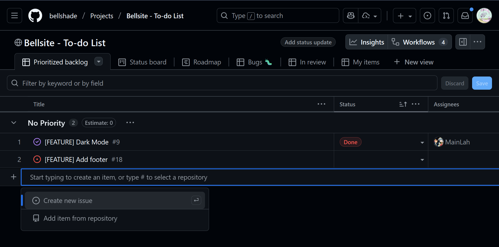
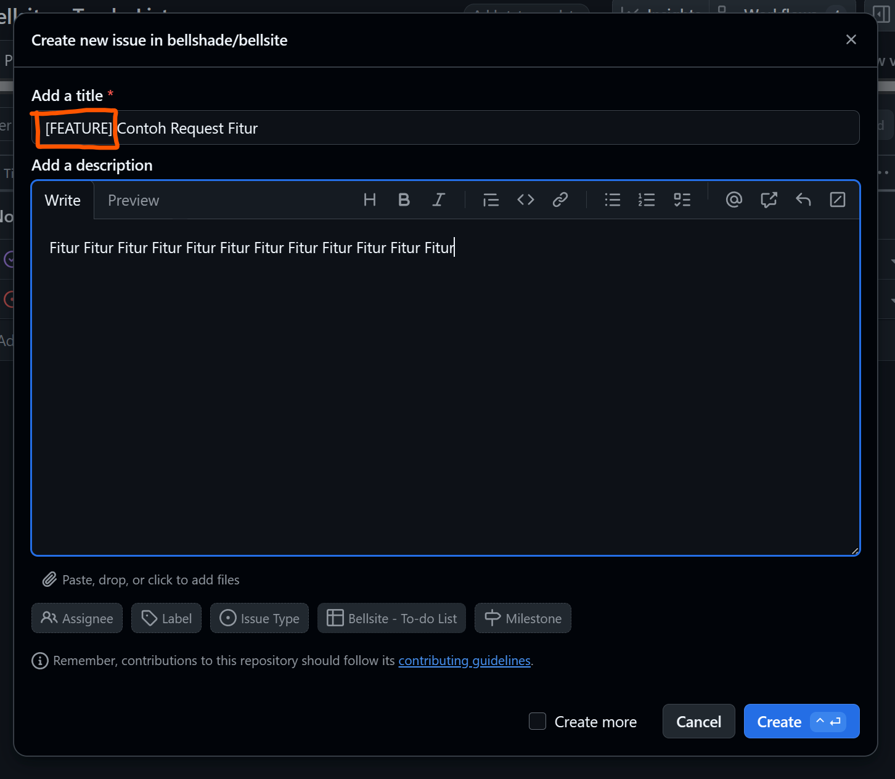
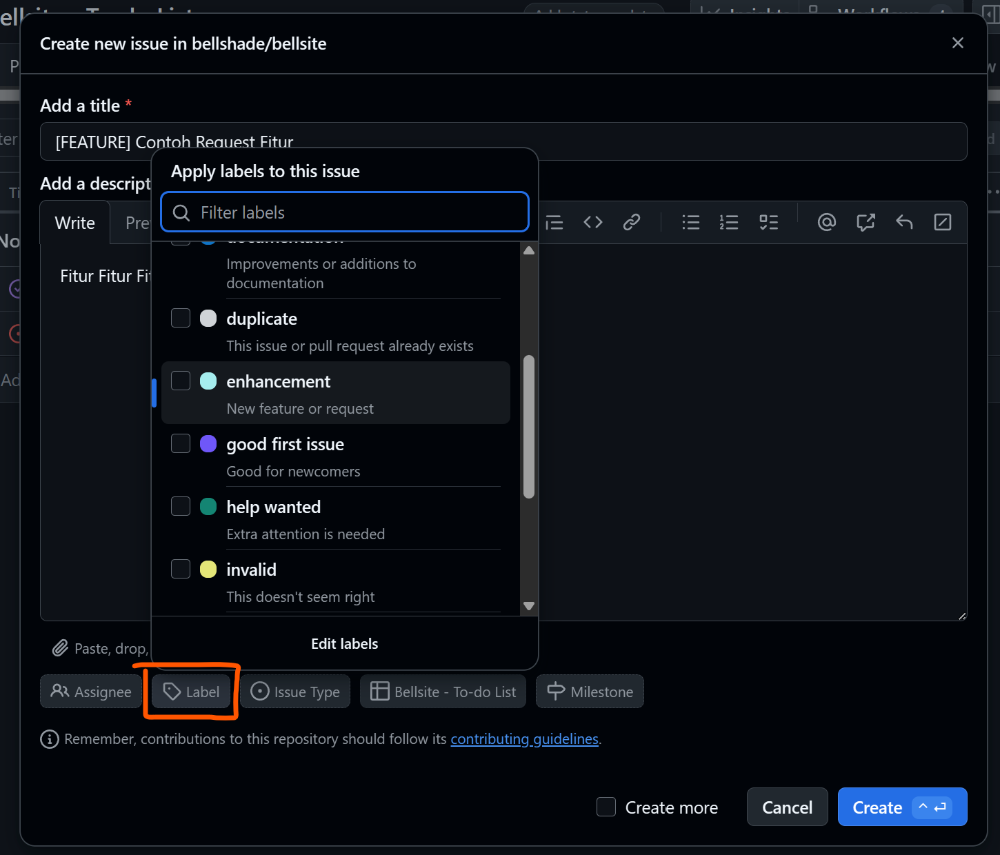

# Guideline Kontribusi

Kami berterima kasih para _helper_, _admin_ dan _member_ WPU yang turut serta berkontribusi dalam pengembangan website Bellshade.

Kontribusi kalian yang akan membantu WPU menjadi Komunitas ngoding paling _wawawaw_ se-Indonesia!

## Jenis Kontribusi

Ada 2 jenis kontribusi yang dapat dilakukan:

### 1. Kontribusi Fitur

Untuk menambahkan/memperbagus fitur, silakan kunjungi tab "Projects", buka project [Bellsite - To-do List](https://github.com/orgs/bellshade/projects/16/views/1) untuk melihat daftar fitur yang bisa ditambahkan.  
Jika ingin menambahkan fitur baru, silakan dulu "Add item" -> "Create new issue" untuk menjelaskan fitur apa yang ingin ditambah dengan awalan "\[FEATURE\]". Silakan menambahkan label yang relevan juga.  
Kemudian lakukan _pull request_ dan sertakan link refensi ke issue yang Anda buat sendiri maupun issue yang dibuat oleh orang lain.

### 2. Kontribusi Bugfix

Untuk bugfix, silakan gunakan prosedur yang sama dengan prosedur di atas, namun saat membuat issue, gunakan awalan "\[BUG\]".

Jika anda menemukan _bug_ pada website ini, silahkan ajukan issue anda dengan:

- menyertakan judul deskriptif diawali "\[BUG\]",
- sertakan label yang sudah disediakan (_bug_, _invalid_, _error_),
- lampirkan tangkapan layar ketika menemukan _bug_.

### 3. Jenis kontribusi lain

Jika ada jenis kontribusi lain misalnya dokumentasi, refactor, dan lainnya, sesuaikan saja awalan issue, misalnya "\[DOCS\]" atau "\[REFACTOR\]".

## Aturan _Pull Request_

1. _Pull request_ yang dijalankan harus lolos proses _build_, dalam kata lain, jalankan `npm run build` sekali sebelum
2. Hidupkan _autoformatter_ Anda, antara dengan menggunakan ekstensi Prettier atau menjalankan `npm run format` pada kodingan Anda.  
   Kodingan yang tidak di-format dengan rapi TIDAK AKAN di-merge.

## Cara Membuat _Pull Request_

Jika anda ingin menambahkan fitur yang belum tersedia kami sangat terbuka untuk membuka kesempatan untuk anda berkarya pada WPU Bellshade kali ini.  
Berikut caranya:

### 1. Fork repository

### 2. Clone repository yang telah di-fork, set up project, `push` ke fork

Silakan ikuti guide setup project di [README](README.md)

### 3. Buka pull request

Silahkan melakukan [_Pull Request_](https://github.com/bellshade/bellsite/pulls) dengan menyertakan:

- Judul, didasarkan pada issue yang direferensi
- Link referensi issue (contoh: References [#16](https://github.com/bellshade/bellsite/pull/16))
- Perubahan yang telah dilakukan

# Hubungi Kami

Jika anda memiliki pertanyaan atau melakukan diskusi lebih lanjut, silahakan hubungi @pixelsam (PixelSamz) di Discord WPU.
