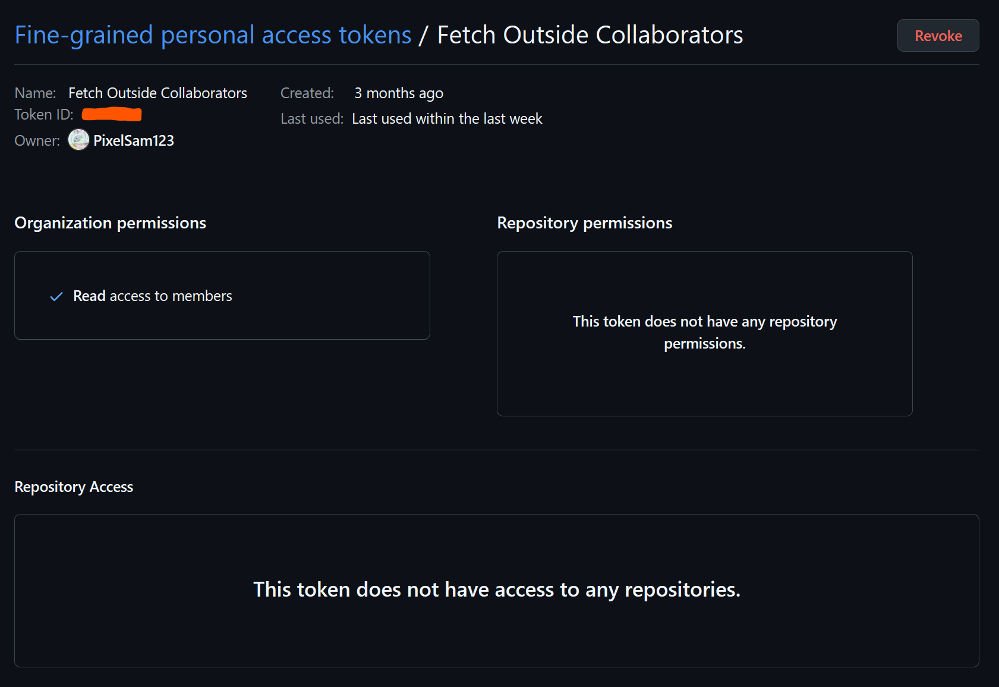

# Bellsite


The new official website for Bellshade\*.

> \*[Bellshade](https://github.com/bellshade) is an open-source project created by WPU Community as an open-source learning platform.

# Why Bellshade?

1. Free learning with the in-browser repository explorer, ensuring ease of access whenever wherever.
2. Open-source, meaning you can contribute to Bellsite or Bellshade. _See `CONTRIBUTING.md` of each repository to learn more._

# Local Development

Apabila Anda belum berada dalam Tim Bellshade Web-Team, silahkan lakukan fork terlebih dahulu. Jika sudah dalam Web-Team, maka hanya perlu melakukan clone.

## Cloning

Untuk melakukan cloning, jalankan:

```bash
git clone https://github.com/bellshade/bellsite.git
```

## Install Dependencies

Lakukan command berikut untuk menginstall dependencies:

```bash
npm install
```

## Setup environment variable

Hanya satu _environment variable_ yang digunakan dalam projek ini, yaitu `GITHUB_API_TOKEN`, yang berisi token yang mempunyai akses _read-only_ terhadap member organisasi Bellshade.  
Jika kalian tidak mengubah halaman `/contributors`, _environment variable_ ini tidak diperlukan.

```
GITHUB_API_TOKEN=
```



## Jalankan di local development

Untuk menjalankan local development di browser, lakukan command berikut:

```bash
npm run dev
```

> Untuk melakukan kontribusi, silahkan membaca [CONTRIBUTE.md](https://github.com/bellshade/bellsite/blob/main/CONTRIBUTING.md) untuk panduan lengkap berkontribusi.

---

Made with <3 by Bellshade Team
